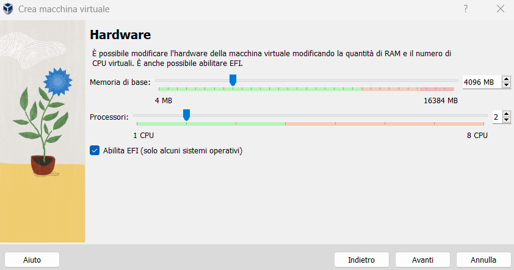
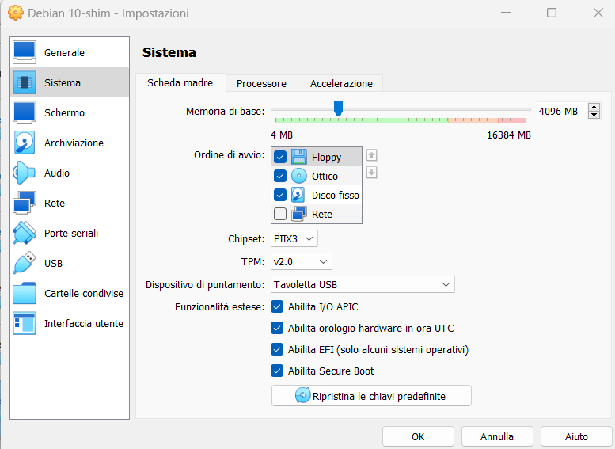
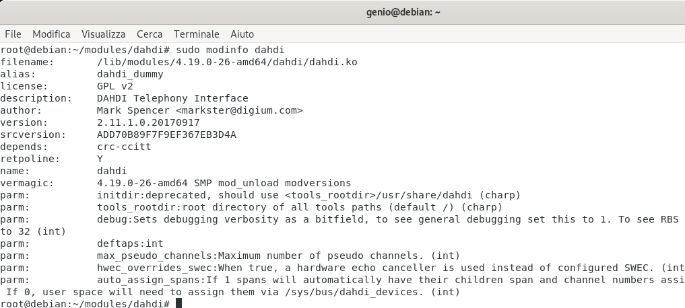
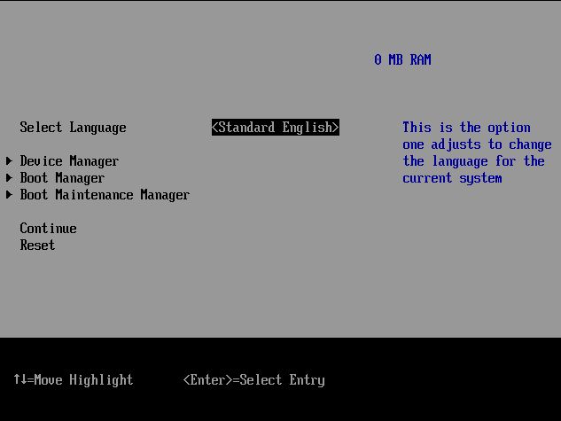

# Secure-Boot-Debian-10
In questo progetto viene descritta la procedura per abilitare UEFI Secure Boot su una distribuzione Debian 10. Il Secure Boot è una funzione aggiunta alle specifiche UEFI 2.3.1 e prevede che ogni file binario utilizzato durante l'avvio del sistema venga convalidato prima dell'esecuzione. La convalida comporta il controllo di una firma mediante un certificato. Il processo descritto in questo progetto si basa sul'utilizzo di Shim, un semplice pacchetto software progettato per funzionare come bootloader di prima fase sui sistemi UEFI.


Una maggiore sicurezza si ha integrando il processo di Secure Boot con un modulo TPM. In questo scenario, il Secure Boot svolge un ruolo attivo di controllo del boot, mentre il TPM registra lo stato della macchina durante l'inizializzazione UEFI. Ciò significa che il TPM fornisce un controllo sullo stato di Secure Boot. L'approccio utilizzato in questo caso per integrare il TPM consiste nel cifrare l'intero disco e decifrarlo automaticamente all'avvio se lo stato misurato dal TPM corrisponde a quello previsto. Il processo complessivo è mostrato di seguito.


## Procedura
### Setup
La procedura qui descritta è stata testata utilizzando Debian 10.13.0-amd64 su una macchina virtuale creata con VirtualBox versione 7. È importante utilizzare l'ultima versione di VirtualBox perché consente di emulare un modulo TPM.

### Configurazione macchina virtuale ed installazione di Debian
Quando si crea una nuova virtual machine, VirtualBox richiede delle informazioni preliminari. In questa fase occorre selezionare il flag *Abilita EFI*.



Dopo aver effettuato queste prime configurazioni, è necessario aprire le impostazioni della VM e sotto la voce *Sistema*, abilitare il Secure Booot e selezionare la versione di TPM da utilizzare.



A questo punto è possibile procedere con l'installazione di Debian. Durante l'installazione è importante configurare la cifratura del disco, fondamentale per integrare il TPM nel processo di Secure Boot. In questo caso è stato effettuato un partizionamento manuale del disco e sono state create quattro partizioni: una per EFI (ESP), una per il boot, una per root e una che funge da aria di swap. Di queste quattro partizioni, quella relativa al file system root e all'area di swap sono state selezionate per la cifratura. Il risultato di questo processo è mestrato di seguito.


### Secure Boot
Ad installazione completata il secure boot è già funzionante e fa affidamento su chiavi presenti di default nel firmaware (in genere chiavi Microsoft e chiavi del produttore della scheda madre) e su Shim. Quest'ultimo è firmato da Microsoft e ingloba la chiave pubblica di Debian che viene usata per verificare i componenti successivi (bootloader GRUB, Kernel, initrd).
Ci sono quattro tipi di chiavi di avvio sicuro integrate nel firmware:

**Database Key (db):** sono le chiavi pubbliche corrispondenti alle chiavi private utilizzate per firmare i file binari quali bootloader, kernel ecc. Possono esserci più chiavi db. La maggior parte dei computer viene fornita con due chiavi Microsoft installate. Microsoft ne utilizza una per sé e l'altra per firmare software di terze parti come Shim.

**Forbidden Signature Key (dbx):** contiene chiavi o hash corrispondenti a malware noti in modo da impedirne l'esecuzione.

**Key Exchange Key (KEK):** possono essere anche più chiavi e vengono utilizzate per firmare le chiavi da immettere in db e dbx in modo che il firmware le accetti come valide. 

**Platform Key (PK):** è una sola ed è usata per firmare le chiavi KEK in modo che siano accettate come valide. Generalmente questa chiave è fornita dal produttore della scheda madre.

A queste quattro tipologie se ne aggiunge una quinta che non appartiene alla parte standard di Secure Boot ma è relativa all'uso di Shim. Si tratta delle chiavi **Machine Owner Key (MOK)**. Sono equivalenti alle chiavi db e possono essere usate per firmare bootloader e altri eseguibili EFI. Quando si vuole ricompilare il kernel o utilizzare un modulo non firmato da Debian occorre creare una nuova chiave, aggiungerla alle chiavi MOK e utilizzarla per firmare ciò che siamo interessati ad eseguire.

In base a quanto appena detto, il processo complessivo di Secure Boot mostrato nell'introduzione può essere rappresentato in maniera più dettagliata come segue.


È possibile dare un'occhiata alle chiavi presenti nel firmware installando il pacchetto *efitools* con:
```
apt install efitools
```
ed eseguendo il comando:
```
efi-readvar
```
Per visualizzare invece le chiavi MOK è possibile utilizzare l'utility *mokutil* con il comando:
```
mokutil --list-enrolled
```
Qui l'unica chiave MOK presente di default è quella di Debian.

### Creare e registrare la propria chiave MOK
Per creare una nuova chiave MOK è possibile utilizzare openssl:
```
mkdir -p /var/lib/shim-signed/mok

cd /var/lib/shim-signed/mok/

openssl req -nodes -new -x509 -newkey rsa:2048 -keyout MOK.priv -outform DER -out MOK.der -days 36500 -subj "/CN=My Name/"

openssl x509 -inform der -in MOK.der -out MOK.pem
```

Occorre poi registrare la chiave appena creata:
```
mokutil --import /var/lib/shim-signed/mok/MOK.der
```
All'esecuzione di questo comando, viene richiesta l'impostazione di una password monouso da usare al successivo riavvio per confermare la registrazione della chiave. Riavviando, quindi, verrà eseguito il MOK manager come mostrato di seguito. 


Da qui è possibile confermare la registrazione con *Enroll MOK* >> *Continue* >> *Yes* >> *[Password scelta]*.

Al riavvio, eseguendo di nuovo il comando `mokutil --list-enrolled` oltre alla chiave Debian comparirà anche la chiave appena registrata.

### Test
Per verificare che tutto funzioni correttamente è possibile scaricare un modulo del kernel Linux non firmato da Debian, compilarlo e provare a caricarlo. In questo caso viene utilizzato il pacchetto dahdi-source. È possibile installare tale pacchetto con `apt install dahdi-source`. Dopo l'installazione, in */usr/src/* viene memorizzato un file .tar.bz2 contenente i sorgenti del modulo. 

*(Per la compilazione del modulo kernel è necessario il pacchetto linux-headers corrispondente alla versione Linux in uso, installabile con `apt install linux-headers-$(uname -r)`).*

Occorre quindi estrarre il contenuto del file .tar.bz2 con:
```
tar -jxvf dahdi.tar.bz2
```
Dopodiché entrare nella cartella */modules/dahdi/* ed eseguire:
```
make && make install && make config
```
 
Se ora viene eseguito il comando `sudo modinfo dahdi` si può vedere che non è presente nessuna firma.



Provando a caricare il modulo con `sudo modprobe dahdi` viene restituito un errore.


Occorre quindi firmare il modulo con la chiave MOK precendentemente generata e per farlo viene utilizzato lo script *sign-file* fornito dal pacchetto *linux-headers*.
```
/usr/src/linux-kbuild-4.19/scripts/sign-file sha256 /var/lib/shim-signed/mok/MOK.priv /var/lib/shim-signed/mok/MOK.der /lib/modules/4.19.0-26-amd64/dahdi/dahdi.ko
```

Eseguendo nuovamente `sudo modinfo dahdi`  è possibile verificare che la firma sia effettivamente stata eseguita.
A questo punto il comando `sudo modprobe dahdi` non restituisce errori e il modulo viene caricato correttamente. 

### Maggiore controllo sul sistema
Per avere un maggiore controllo sul sistema, è possibile sostituire le chiavi PK, KEK e db presenti nel firmware con delle chiavi create da noi. In questo modo verrà eseguito solo il software firmato con le nostre chiavi. Per fare ciò occorre creare tre nuove chiavi e, siccome programmi diversi richiedono formati diversi, si ha la necessità di avere più formati. Tutte le operazioni necessarie possono essere automatizzate con il seguente script (KeySB.sh).
```bash
#!/bin/bash

#Create keys
openssl req -new -x509 -newkey rsa:2048 -subj "/CN=My PK/" -keyout PK.key \
        -out PK.crt -days 3650 -nodes -sha256
openssl req -new -x509 -newkey rsa:2048 -subj "/CN=My KEK/" -keyout KEK.key \
        -out KEK.crt -days 3650 -nodes -sha256
openssl req -new -x509 -newkey rsa:2048 -subj "/CN=My DB/" -keyout DB.key \
        -out DB.crt -days 3650 -nodes -sha256

#Create DER version
openssl x509 -in PK.crt -out PK.cer -outform DER
openssl x509 -in KEK.crt -out KEK.cer -outform DER
openssl x509 -in DB.crt -out DB.cer -outform DER

apt install uuid-runtime
uuidgen --random > GUID.txt

#Convert a certificate into a EFI signature list
cert-to-efi-sig-list -g "$(< GUID.txt)" PK.crt PK.esl
cert-to-efi-sig-list -g "$(< GUID.txt)" KEK.crt KEK.esl
cert-to-efi-sig-list -g "$(< GUID.txt)" DB.crt DB.esl

#Sign EFI signature list
sign-efi-sig-list -g "$(< GUID.txt)" -k PK.key -c PK.crt PK PK.esl PK.auth
sign-efi-sig-list -g "$(< GUID.txt)" -a -k PK.key -c PK.crt KEK KEK.esl KEK.auth
sign-efi-sig-list -g "$(< GUID.txt)" -a -k KEK.key -c KEK.crt DB DB.esl DB.auth
```

Una volta eseguito questo script, le chiavi create devono essere registrate all'interno del firmware. A tale scopo è necessario copiare i file PK, KEK e DB con estensione .cer all'interno della partizione EFI (*/boot/efi/EFI/debian/*) e riavviare il pc per entrare nelle impostazioni del firmware UEFI. 



Da questo menù è possibile seguire la seguente procedura: 

*Device Manager* >> *Secure Boot Configuration* >> *Secure Boot Mode* >> *Custom Mode*. 

A questo punto comparirà il menù *Custom Secure Boot Options*. Entrando in questo menù si possono gestire le chiavi presenti nel firmware. 


A partire dalla chiave DB si va quindi ad eliminare la chiave esistente (*Delete key* >> Premere *Invio* in corrispondenza della chiave da eliminare) e ad aggiungere la chiave creata da noi (*Enroll key* >> *Enroll key using file* >> Selezionare il volume mostrato >> *EFI* >> *debian* >> *DB.cer*). Salvare le modifiche e ripetere la procedura anche per le chiavi KEK e PK.

Al riavvio del sistema comparirà una finestra di errore come questa. 


Questo perché avendo sostituito la chiave db di Microsoft, Shim non risulta più verificato e la sua esecuzione viene bloccata. Occorre spegnere la VM e disabilitare il Secure Boot dalle impostazioni affinché il sistema possa essere avviato correttamente. Una volta avviato il sistema è possibile varificare che le nostre chiavi siano state effettivamente registrate nel firmware con il comando `efi-readvar`.

Per far funzionare correttamente il Secure Boot occorre firmare Shim con la nostra chiave db:
```
sbsign --key DB.key --cert DB.crt --output /boot/efi/EFI/debian/shimx64.efi /boot/efi/EFI/debian/shimx64.efi
```
A questo punto è possibile spegnere la VM e abilitare il Secure Boot che funzionerà correttamente.

*NB: è possibile firmmare Shim non appena la chiave db viene generata; tuttavia in questo caso si è preferito firmarlo in seguito alla sostituzione delle chiavi nel firmware per evidenziare il corretto funzionamento di Secure Boot che blocca l'avvio in caso di software non verificato.*

### Integrazione TPM


## Riferimenti
https://wiki.debian.org/SecureBoot

https://www.rodsbooks.com/efi-bootloaders/controlling-sb.html

https://ubs_csse.gitlab.io/secu_os/tutorials/linux_secure_boot.html
