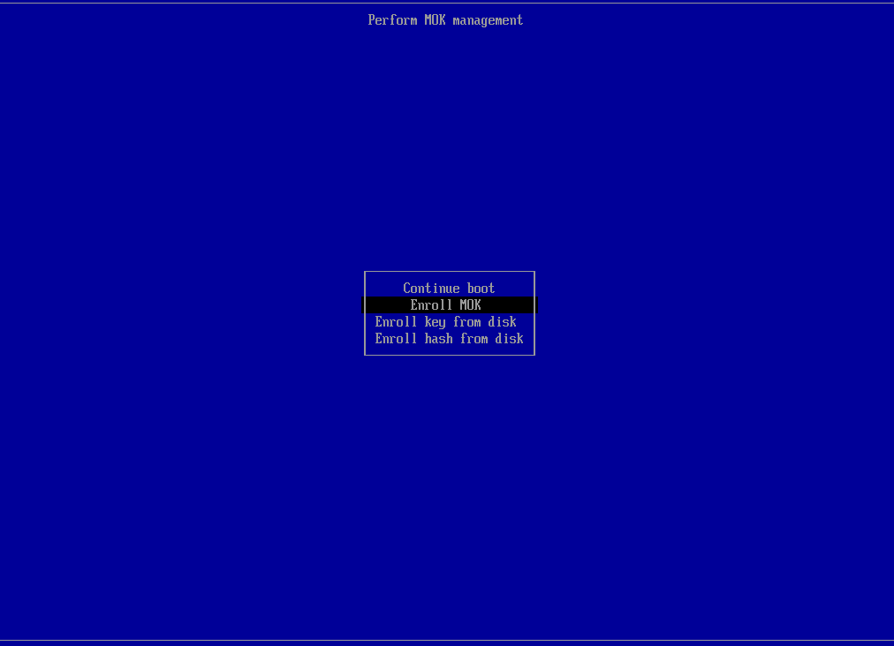
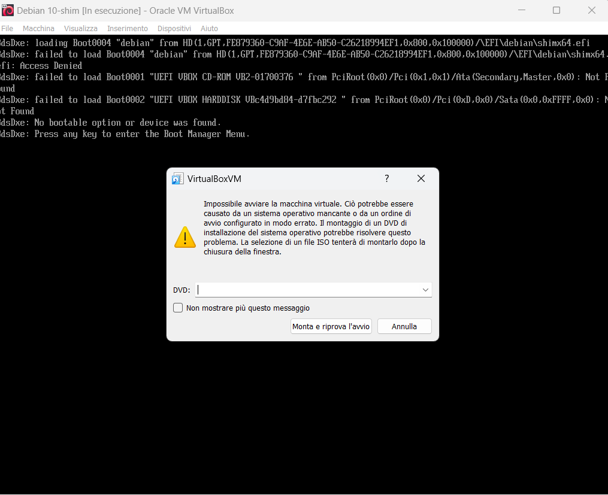
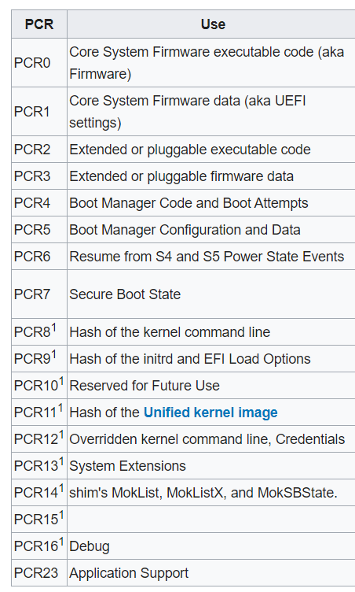
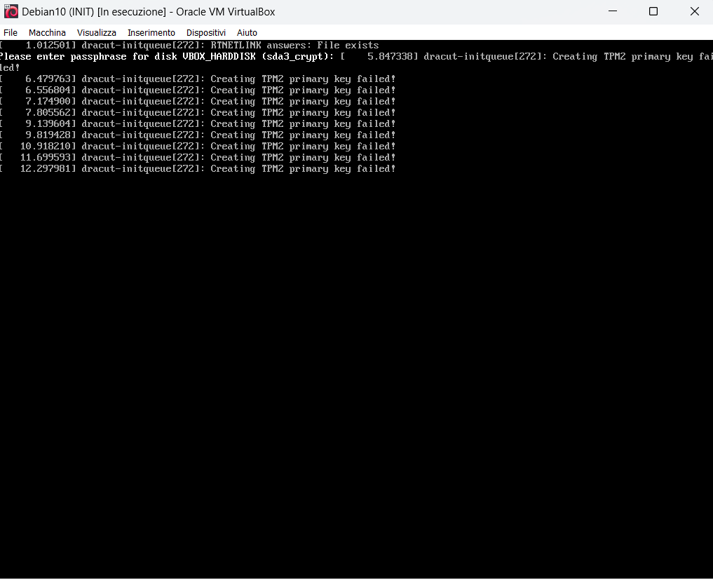
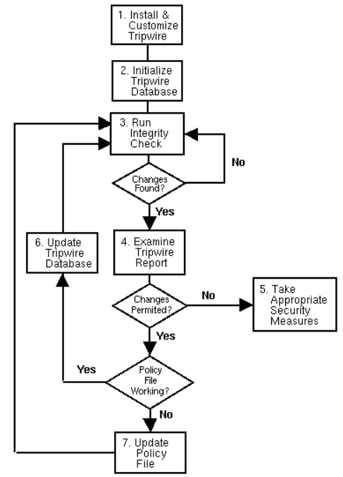
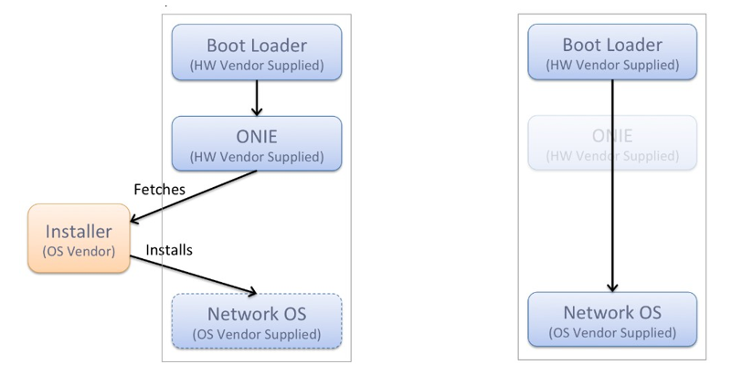

# Secure-Boot-Debian-10
In questo progetto viene descritta la procedura per abilitare UEFI Secure Boot su una distribuzione Debian 10. Il Secure Boot è una funzione aggiunta alle specifiche UEFI 2.3.1 e prevede che ogni file binario utilizzato durante l'avvio del sistema venga convalidato prima dell'esecuzione. La convalida comporta il controllo di una firma mediante un certificato. Il processo descritto in questo progetto si basa sul'utilizzo di Shim, un semplice pacchetto software progettato per funzionare come bootloader di prima fase sui sistemi UEFI. Le fasi previste dal Secure Boot sono illustrate nella figura seguente.


Una maggiore sicurezza si ha integrando il processo di Secure Boot con un modulo TPM. In questo scenario, il Secure Boot svolge un ruolo attivo di controllo del boot, mentre il TPM fornisce un controllo sullo stato del sistema. L'approccio utilizzato in questo caso per integrare il TPM consiste nel cifrare alcune partizioni del disco e decifrarle automaticamente all'avvio se lo stato misurato dal TPM corrisponde a quello previsto. Il processo complessivo è mostrato di seguito.


Inoltre, viene implementato anche un controllo di integrità utilizzando Tripwire nella sua versione open source, in modo da avere il pieno controllo su tutte le modifiche riguardanti i file critici del sistema.

## Procedura
### Setup
La procedura qui descritta è stata testata utilizzando Debian 10.13.0-amd64 su una macchina virtuale creata con VirtualBox versione 7. È importante utilizzare l'ultima versione di VirtualBox perché consente di emulare un modulo TPM.

### Configurazione macchina virtuale ed installazione di Debian
Quando si crea una nuova virtual machine, VirtualBox richiede delle informazioni preliminari. In questa fase occorre selezionare il flag *Abilita EFI*.


Dopo aver effettuato queste prime configurazioni, è necessario aprire le impostazioni della VM e sotto la voce *Sistema*, abilitare il Secure Boot e selezionare la versione di TPM da utilizzare.


A questo punto è possibile procedere con l'installazione di Debian. Durante l'installazione è importante configurare la cifratura del disco, fondamentale per integrare il TPM nel processo di Secure Boot. In questo caso è stato effettuato un partizionamento manuale del disco e sono state create sei partizioni: 
* **ESP:** partizione EFI.
* **boot:** contiene tutti i file necessari al boot del sistema.
* **root (/):** questa partizione viene lasciata in chiaro ma sarà sottoposta a controllo di integrità tramite Tripwire.
* **home:** contiene le applicazioni. Tale partizione verrà cifrata con luks+TPM.
* **secrets:** contiene i segreti del nostro sistema. Tale partizione verrà cifrata con luks+TPM.
* **swap:** area di swap. Tale partizione verrà cifrata con luks+TPM.


### Secure Boot
Ad installazione completata il secure boot è già funzionante e fa affidamento su chiavi presenti di default nel firmaware (in genere chiavi Microsoft e chiavi del produttore della scheda madre) e su Shim. Quest'ultimo è firmato da Microsoft e ingloba la chiave pubblica di Debian che viene usata per verificare i componenti successivi (bootloader GRUB, Kernel, initrd).
Ci sono quattro tipi di chiavi di avvio sicuro integrate nel firmware:

**Database Key (db):** sono le chiavi pubbliche corrispondenti alle chiavi private utilizzate per firmare i file binari quali bootloader, kernel ecc. Possono esserci più chiavi db. La maggior parte dei computer viene fornita con due chiavi Microsoft installate. Microsoft ne utilizza una per sé e l'altra per firmare software di terze parti come Shim.

**Forbidden Signature Key (dbx):** contiene chiavi o hash corrispondenti a malware noti in modo da impedirne l'esecuzione.

**Key Exchange Key (KEK):** possono essere anche più chiavi e vengono utilizzate per firmare le chiavi da immettere in db e dbx in modo che il firmware le accetti come valide. 

**Platform Key (PK):** è una sola ed è usata per firmare le chiavi KEK in modo che siano accettate come valide. Generalmente questa chiave è fornita dal produttore della scheda madre.

A queste quattro tipologie se ne aggiunge una quinta che non appartiene alla parte standard di Secure Boot ma è relativa all'uso di Shim. Si tratta delle chiavi **Machine Owner Key (MOK)**. Sono equivalenti alle chiavi db e possono essere usate per firmare bootloader e altri eseguibili EFI. Quando si vuole ricompilare il kernel o utilizzare un modulo non firmato da Debian occorre creare una nuova chiave, aggiungerla alle chiavi MOK e utilizzarla per firmare ciò che siamo interessati ad eseguire.

In base a quanto appena detto, il processo complessivo di Secure Boot mostrato nell'introduzione può essere rappresentato in maniera più dettagliata come segue.


È possibile dare un'occhiata alle chiavi presenti nel firmware installando il pacchetto *efitools* con:
```
apt install efitools
```
ed eseguendo il comando:
```
efi-readvar
```
Per visualizzare invece le chiavi MOK è possibile utilizzare l'utility *mokutil* con il comando:
```
mokutil --list-enrolled
```
Qui l'unica chiave MOK presente di default è quella di Debian.

### Creare e registrare la propria chiave MOK
Per creare una nuova chiave MOK è possibile utilizzare openssl:
```
mkdir -p /var/lib/shim-signed/mok

cd /var/lib/shim-signed/mok/

openssl req -nodes -new -x509 -newkey rsa:2048 -keyout MOK.priv -outform DER -out MOK.der -days 36500 -subj "/CN=My Name/"

openssl x509 -inform der -in MOK.der -out MOK.pem
```

Occorre poi registrare la chiave appena creata:
```
mokutil --import /var/lib/shim-signed/mok/MOK.der
```
All'esecuzione di questo comando, viene richiesta l'impostazione di una password monouso da usare al successivo riavvio per confermare la registrazione della chiave. Riavviando, quindi, verrà eseguito il MOK manager come mostrato di seguito. 



Da qui è possibile confermare la registrazione con *Enroll MOK* >> *Continue* >> *Yes* >> *[Password scelta]*.

Al riavvio, eseguendo di nuovo il comando `mokutil --list-enrolled` oltre alla chiave Debian comparirà anche la chiave appena registrata.

### Test
Per verificare che tutto funzioni correttamente è possibile scaricare un modulo del kernel Linux non firmato da Debian, compilarlo e provare a caricarlo. In questo caso viene utilizzato il pacchetto dahdi-source. È possibile installare tale pacchetto con `apt install dahdi-source`. Dopo l'installazione, in */usr/src/* viene memorizzato un file .tar.bz2 contenente i sorgenti del modulo. 

*(Per la compilazione del modulo kernel è necessario il pacchetto linux-headers corrispondente alla versione Linux in uso, installabile con `apt install linux-headers-$(uname -r)`).*

Occorre quindi estrarre il contenuto del file .tar.bz2 con:
```
tar -jxvf dahdi.tar.bz2
```
Dopodiché entrare nella cartella */modules/dahdi/* ed eseguire:
```
make && make install && make config
```
 
Se ora viene eseguito il comando `sudo modinfo dahdi` si può vedere che non è presente nessuna firma.


Provando a caricare il modulo con `sudo modprobe dahdi` viene restituito un errore.


Occorre quindi firmare il modulo con la chiave MOK precendentemente generata e per farlo viene utilizzato lo script *sign-file* fornito dal pacchetto *linux-headers*.
```
/usr/src/linux-kbuild-4.19/scripts/sign-file sha256 /var/lib/shim-signed/mok/MOK.priv /var/lib/shim-signed/mok/MOK.der /lib/modules/4.19.0-26-amd64/dahdi/dahdi.ko
```

Eseguendo nuovamente `sudo modinfo dahdi`  è possibile verificare che la firma sia effettivamente stata eseguita.
A questo punto il comando `sudo modprobe dahdi` non restituisce errori e il modulo viene caricato correttamente. 

### Modifica delle chiavi PK, KEK, DB
Per avere un maggiore controllo sul sistema, è possibile sostituire le chiavi PK, KEK e db presenti nel firmware con delle chiavi create da noi. In questo modo verrà eseguito solo il software firmato con le nostre chiavi. Per fare ciò occorre creare tre nuove chiavi e, siccome programmi diversi richiedono formati diversi, si ha la necessità di avere più formati. Tutte le operazioni necessarie possono essere automatizzate con il seguente script (KeySB.sh).
```bash
#!/bin/bash

#Create keys
openssl req -new -x509 -newkey rsa:2048 -subj "/CN=My PK/" -keyout PK.key \
        -out PK.crt -days 3650 -nodes -sha256
openssl req -new -x509 -newkey rsa:2048 -subj "/CN=My KEK/" -keyout KEK.key \
        -out KEK.crt -days 3650 -nodes -sha256
openssl req -new -x509 -newkey rsa:2048 -subj "/CN=My DB/" -keyout DB.key \
        -out DB.crt -days 3650 -nodes -sha256

#Create DER version
openssl x509 -in PK.crt -out PK.cer -outform DER
openssl x509 -in KEK.crt -out KEK.cer -outform DER
openssl x509 -in DB.crt -out DB.cer -outform DER

apt install uuid-runtime
uuidgen --random > GUID.txt

#Convert a certificate into a EFI signature list
cert-to-efi-sig-list -g "$(< GUID.txt)" PK.crt PK.esl
cert-to-efi-sig-list -g "$(< GUID.txt)" KEK.crt KEK.esl
cert-to-efi-sig-list -g "$(< GUID.txt)" DB.crt DB.esl

#Sign EFI signature list
sign-efi-sig-list -g "$(< GUID.txt)" -k PK.key -c PK.crt PK PK.esl PK.auth
sign-efi-sig-list -g "$(< GUID.txt)" -a -k PK.key -c PK.crt KEK KEK.esl KEK.auth
sign-efi-sig-list -g "$(< GUID.txt)" -a -k KEK.key -c KEK.crt DB DB.esl DB.auth
```

Una volta eseguito questo script, le chiavi create devono essere registrate all'interno del firmware. A tale scopo è necessario copiare i file PK, KEK e DB con estensione .cer all'interno della partizione EFI (*/boot/efi/EFI/debian/*) e riavviare il pc per entrare nelle impostazioni del firmware UEFI. 


Da questo menù è possibile seguire la seguente procedura: 

*Device Manager* >> *Secure Boot Configuration* >> *Secure Boot Mode* >> *Custom Mode*. 

A questo punto comparirà il menù *Custom Secure Boot Options*. Entrando in questo menù si possono gestire le chiavi presenti nel firmware. 


A partire dalla chiave DB si va quindi ad eliminare la chiave esistente (*Delete key* >> Premere *Invio* in corrispondenza della chiave da eliminare) e ad aggiungere la chiave creata da noi (*Enroll key* >> *Enroll key using file* >> Selezionare il volume mostrato >> *EFI* >> *debian* >> *DB.cer*). Salvare le modifiche e ripetere la procedura anche per le chiavi KEK e PK.

Al riavvio del sistema comparirà una finestra di errore come questa. 



Questo perché avendo sostituito la chiave db di Microsoft, Shim non risulta più verificato e la sua esecuzione viene bloccata. Occorre spegnere la VM e disabilitare il Secure Boot dalle impostazioni affinché il sistema possa essere avviato correttamente. Una volta avviato il sistema è possibile varificare che le nostre chiavi siano state effettivamente registrate nel firmware con il comando `efi-readvar`.

Per far funzionare correttamente il Secure Boot occorre firmare Shim con la nostra chiave db:
```
sbsign --key DB.key --cert DB.crt --output /boot/efi/EFI/debian/shimx64.efi /boot/efi/EFI/debian/shimx64.efi
```
A questo punto è possibile spegnere la VM e abilitare il Secure Boot che funzionerà correttamente.

*NB: è possibile firmmare Shim non appena la chiave db viene generata; tuttavia in questo caso si è preferito firmarlo in seguito alla sostituzione delle chiavi nel firmware per evidenziare il corretto funzionamento di Secure Boot che blocca l'avvio in caso di software non verificato.*

### Integrazione TPM
Una volta terminata la configurazione del secure boot, è possibile passare all'integrazione del TPM. In particolare, vengono utilizzati i Platform Configuration Regiters (PCR) del TPM, nei quali vengono memorizzati gli hashes relativi allo stato del sistema. Nella sguente tabella vengono mostrate le informazioni registrate nei principali PCR.



In questo caso vengono utilizzati PCR0, PCR1, PCR7 e PCR14.

Per legare la cifratura del disco ai valori presenti in tali registri viene utilizzato *Clevis*, un framework che consente di associare un volume LUKS a un sistema creando una chiave, crittografandola utilizzando il TPM e sigillando la chiave utilizzando valori PCR che rappresentano lo stato del sistema al momento della creazione della chiave. Occorre quindi installare i relativi pacchetti:

```
apt install -y clevis clevis-luks clevis-tpm2 clevis-dracut
```

Fatto ciò basta un sepmlice comando per far sì che il disco si sblocchi in automatico all'avvio in base ai valori dei PCR selezionati. Il comando è il seguente:

```
clevis luks bind -d /dev/sda4 -s 2 tpm2 '{"hash":"sha256","key":"rsa","pcr_bank":"sha256","pcr_ids":"0,1,7,14"}'
```
L'esecuzione di questo comando richiede di inserire la password di decifratura già esistente per la partizione (in questo caso partizione home). Questo comando va eseguito per tutte le partizioni che si desidera cifrare con TPM e decifrare in maniera automatica all'avvio, quindi viene ripetuto anche per le partizioni secrets (/dev/sda5) e swap (/dev/sda6).

*Nota: oltre allo sblocco tramite TPM, si consiglia di registrare un'altra chiave di decifratura per le varie partizioni, in caso contrario una eventuale manomissione renderebbe il sistema non più accessibile. La nuova chiave va conservata al sicuro su un dispositivo separato. Va inoltre eliminata la passphrase impostata inizialmente in quanto risulta essere debole.*

### Test
Per verificare che il controllo dello stato funzioni correttamente è possibile provare a disabilitare il secure boot dalle impostazioni della macchina virtuale oppure ad entrare ed uscire dal menù UEFI durante l'avvio della macchina virtuale. In entrambi i casi il disco non viene sbloccato in automatico, ma viene richiesta la chiave. Lo stesso risultato si ha se si prova ad aggiungere un'ulteriore chiave MOK.

### Problemi
In Debian 10 è possibile riscontrare dei problemi con l'utilizzo del TPM. Nel mio caso, al momento della decifratura del disco viene restituito il seguente errore.



Tuttavia, utilizzando la stessa procedura su una distribuzione Debian 11, il tutto funziona perfettamente.

### Controllo di integrità con Tripwire
Tripwire è un tool di sicurezza che consente di monitorare le modifiche apportate a file e directory rispetto a uno stato sicuro di partenza. Qui viene applicato alla partizione root. Il funzionamento di Tripwire può essere schematizzato come segue:



In pratica, viene utilizzato un file di policy dove vengono indicate le regole che stabiliscono quali oggetti devono essere controllati ed in che modo. Sulla base di queste policy, Tripwire calcola una fotografia del sistema quando è in uno stato sicuro, memorizzando un insieme di informazioni relative ad ogni oggetto (file e directory) che vogliamo proteggere da eventuali manomissioni. Questo è possibile mediante l'impiego di funzioni hash. Questa fotografia viene conservata in un file apposito (database dei file di sistema).

Quando viene effettuato l'integrity check, viene calcolata una nuova fotografia del sistema e viene confrontata con quella conservata nel database. Il risultato di questo confronto è un file di report in cui vengono evidenziate tutte modifiche che sono state apportate al sistema rispetto allo stato sicuro. A questo punto spetta all'amministratore stabilire se le modifiche sono dannose o meno per il sistema, e prendere le dovute contromisure. Tripwire può essere configurato in modo da inviare una e-mail all’amministratore del sistema in caso di modifiche critiche per la sicurezza.

Per proteggersi da modifiche non autorizzate, Tripwire memorizza i suoi file più importanti (database, policy, configurazione e report) in un formato binario interno, dopodichè vi applica una firma digitale. In particolare, Tripwire si avvale di due key file: site key e local key (ognuno dei quali è generato tramite il comando twadmin e contiene una coppia di chiavi pubblica/privata). La prima serve a firmare il file di configurazione e il file di policy; l'altra viene utilizzata per firmare il database e i report. Di conseguenza, modificare o sostituire i suddetti file richiede la conoscenza della chiave privata, la quale è cifrata con una passphrase generata in fase di installazione.

Per installare Tripwire su Debian è possibile utilizzare il seguente comando:
```
apt install -y tripwire
```
Lo script per la configurazione di Tripwire partirà in automatico permettendo di generare il file di configurazione, il file di policy, le chiavi site.key e local.key e le rispettive passphrases. Il file di configurazione, il file di policy e le chiavi vengono memorizzate nella cartella */etc/tripwire/*.

Fatto ciò è possibile modificare il file di policy in base alle proprie esigenze. Può essere utile partire dal file di default che all'inizio viene fornito sia nel formato utilizzato da tripwire sia in formato testuale. Il file di policy è costituito da regole in cui viene indicato il path completo dei file o della directory che si vuole monitorare e gli attributi che ci interessano di questi file. Gli attributi che Tripwire permette di monitorare sono i seguenti:


Per semplificare le cose è possibile anche definire delle variabili che definiscono quali proprietà monitorare. Alcune di queste variabili sono presenti di default e sono indicate nella tabella in basso.


Per rendere effettive tali configurazioni occorre eseguire il comando seguente, il quale codifica il nuovo file di configurazione e lo firma con la site key.
```
twadmin --create-polfile -S /etc/tripwire/site.key /etc/tripwire/twpol.txt
```

Dopodiché occorre inizializzare il database:
```
tripwire --init
```

Tale comando crea il database con i dati dei file da monitorare. Una volta fatto ciò i file di configurazione e di policy che sono in formato testuale (.txt) devono essere eliminati.

A questo punto per eseguire un controllo sull'integrità del sistema non ci resta che eseguire:
```
tripwire --check
```
Questo comporta la creazione di un report con tutte le modifiche rilevate.

Infine, è possibile sfruttare l'utility *cron* di Linux per programmare l'esecuzione di un check in modo periodico e del tutto automatico. Per farlo basta modificare la *crontab* di Linux eseguendo 
```
crontab -e
```
ed inserendo la riga 
```
0 5 * * * /usr/sbin/tripwire --check
```

In questo caso è stato configurato un controllo di integrità tutti i giorni alle ore 05:00.

## Caso d'uso
La procedura qui descritta è pensata per essere implementata in uno scenario di rete reale. L'idea di base è quella di utilizzare ONIE (Open Network Install Environment) + ONL (Open Network Linux). ONIE è la combinazione di un boot loader e di un piccolo sistema operativo per switch di rete che fornisce un ambiente per il provisioning automatizzato, mentre ONL è una distribuzione Linux per switch bare metal.

Quando una nuova macchina si avvia per la prima volta, ONIE individua ed esegue il programma di installazione di ONL (figura a sinistra). Dopo l'installazione iniziale, i successivi avvii passano direttamente ad ONL, bypassando ONIE (figura a destra).



Sia ONIE che ONL sono sistemi operativi basati su Linux, pertanto, l'applicazione del Secure Boot con shim è appropriata.

In tal caso, dovrà essere costruita un'apposita immagine ONIE per il Secure Boot. Questa immagine dovrà contenere:
1. Shim, firmato da una chiave presente nel DB e con la chiave del fornitore di ONIE incorporata.
2. Grub firmato con la chiave ONIE.
3. Linux kernel di ONIE firmato con la chiave ONIE.

In questo modo si otterrà un file .ISO di ONIE configurato per l'avvio sicuro. Occorre poi estendere la fiducia anche alle ONIE installable images, ovvero a quelle immagini che ONIE è in grado di scaricare ed installare (nel nostro caso l'immagine ONL). Per fare ciò è necessario che l'immagine ONL abbia un determinato formato, suddivisio in tre parti:
1. Executable Installer Data, ovvero la porzione di immagine che ONIE esegue per installare il sistema operativo.
2. Signature, applicata alla Executable Installer Data.
3. Image Information Block, contenete le informazioni sulla firma applicata.

Inoltre, deve essere fornito il certificato per verificare tale firma in modo da poterlo inserire nel processo di Secure Boot.

Allo stesso modo, anche l'immagine di installazione di ONL deve contenere tutti i binari necessari per l'avvio sicuro: una propria versione di Shim firmata da una chiave DB e con la chiave per verificare ONL incorporata, e i rispettivi binari di grub e linux kernel anch'essi firmati con la chiave ONL.

## Riferimenti
### Secure Boot

https://wiki.debian.org/SecureBoot

https://www.rodsbooks.com/efi-bootloaders/controlling-sb.html

https://ubs_csse.gitlab.io/secu_os/tutorials/linux_secure_boot.html

### TPM e Clevis

https://wiki.archlinux.org/title/Trusted_Platform_Module

https://wiki.archlinux.org/title/Clevis

https://access.redhat.com/documentation/fr-fr/red_hat_enterprise_linux/9/html/security_hardening/configuring-manual-enrollment-of-volumes-using-tpm2_configuring-automated-unlocking-of-encrypted-volumes-using-policy-based-decryption

### Tripwire

http://www.di-srv.unisa.it/~ads/corso-security/www/CORSO-0304/Tripwire-Linux/index.htm

http://www.di-srv.unisa.it/~ads/corso-security/www/CORSO-0102/tripwire/tripwire.htm

https://github.com/Tripwire/tripwire-open-source?tab=readme-ov-file

### ONIE
https://opencomputeproject.github.io/onie/overview/index.html

http://mirror.opencompute.org/onie/docs/ONIESecureBootv2.pdf
